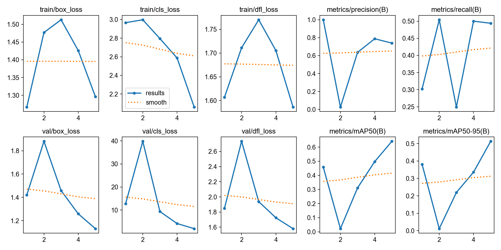

This project trains a YOLOv8 model to detect gym equipment in images using custom data and optimized training settings.

Project Structure
├── train-part.py
├── data.yaml
├── requirements.txt
├── setup_gpu.bat
├── test/
│   ├── images/
│   └── labels/
├── train/
│   ├── images/
│   └── labels/
├── valid/
│   ├── images/
│   └── labels/

Setup
Clone the repository
git clone https://github.com/yourusername/your-repo.git
cd your-repo

Install dependencies
pip install -r requirements.txt

Setup GPU
Run setup_gpu.bat if you need to configure your environment for CUDA.

Training
Run the training script:
python train-part.py

Training uses YOLOv8 with custom arguments for improved performance.
Training/validation/test data and labels are organized in the respective folders.

Data Format
Images are stored in images
YOLO-format label files are in labels
data.yaml defines dataset splits and class names

Results
Training logs, plots, and model weights are saved in the runs directory (created by YOLO).
Model weights (.pt files) are not included in the repository due to size.

Training Metrics:
Metric	Value
mAP@0.5: 0.641
mAP@0.5: 0.513
Precision: 	0.789
Recall: 0.504 
F1 Score	

Notes
All large files are excluded from git history and ignored via .gitignore.
For best results, ensure your system has a CUDA-capable GPU and compatible drivers.

References
Ultralytics YOLOv8 Documentation
YOLO Format Explained
